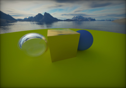
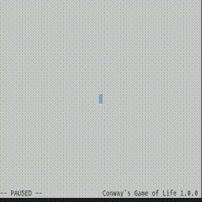

## 👋 Hello world! 👋

### 👦 **About me**
My name is **Alan Jian**. I'm a Taiwanese high school student at [Wu-Ling Senior High School](https://en.wikipedia.org/wiki/Wu-Ling_Senior_High_School). I am incredibly passionate about programming and everything tech-related! I'm particularly interested in operating system development and computer graphics. Since I was in primary school, I have spent over eight years attempting to learn everything there is to know more about computer science. In addition, I'm eager to know parts of mathematics that are useful in real life and programming like calculus and linear algebra.

### 🕹️ **Interested Fields**
* **Computer Graphics**, especially *Rasterization*
* **Operating System Developement**
* **Embedded Devices**, mostly on *ARM* (both *AArch32* and *AArch64*) devices
* **Retro Emulator Development**
* **Computer Network**

### 📜 **Experiences**
* Speaker @ [SITCON X](https://sitcon.org/2022/) (2022/09/21)

### 🗄️ **Showcase**
|   [Cephalon](https://github.com/alanjian85/cephalon)    | [NES](https://github.com/alanjian85/nes) |
|---------------------------------------------------------|------------------------------------------|
|                            |                       |

| [Ray Tracing Now!](https://github.com/alanjian85/rtnow) | [CGL](https://github.com/alanjian85/cgl) |
|---------------------------------------------------------|------------------------------------------|
|                       |                       |

|         [Box](https://github.com/alanjian85/box)        |
|---------------------------------------------------------|
|                                          |

### ☎️  **Contact me**
📬 Email: [alanjian85@outlook.com](mailto:alanjian85@outlook.com)

💻 Blog: [alanjian85.github.io](https://alanjian85.github.io/)
