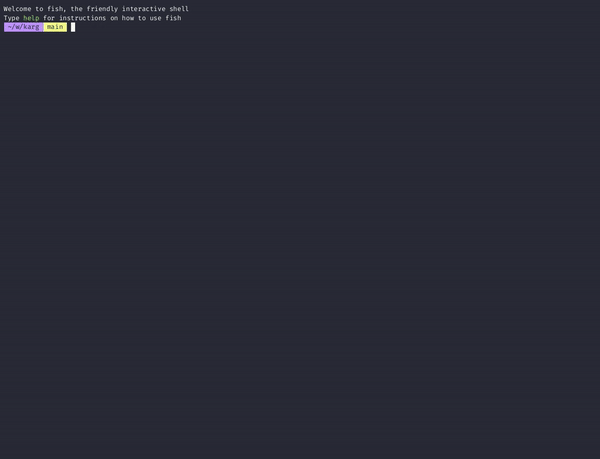
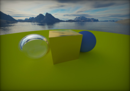
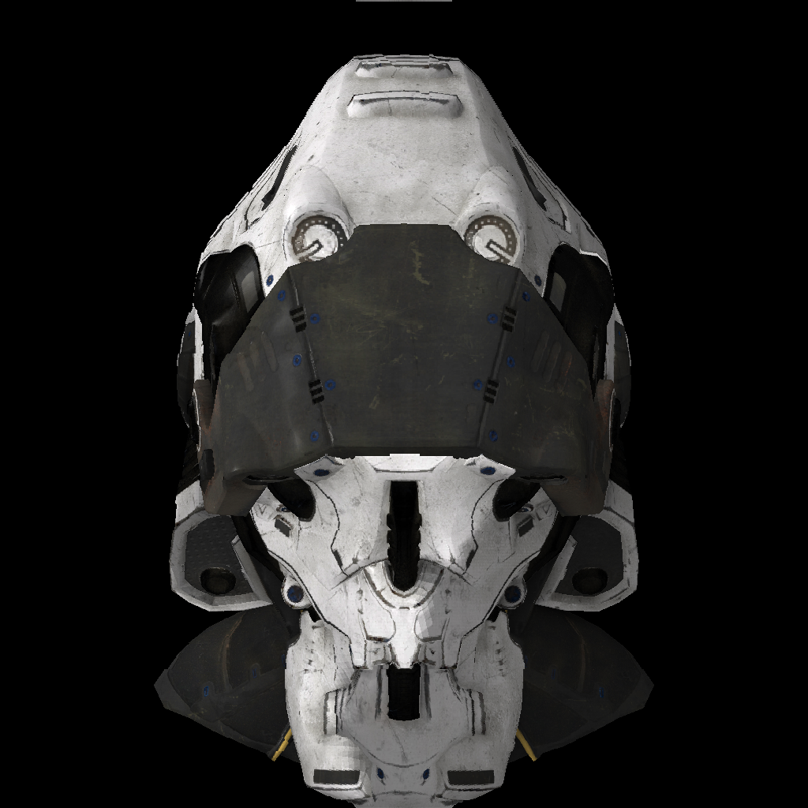

## Hello world!

### **whoami**
I am **Alan Jian**, a Taiwanese high schooler at [Wu-Ling Senior High School](https://en.wikipedia.org/wiki/Wu-Ling_Senior_High_School). 

### **Fields of Interest**
* **Operating System Developement**
* **Computer Graphics**, especially Rasterization
* **RISC CPU Architectures** like RISC-V and ARM
* **Emulator Development**
* **Linear Algebra**

### **Activities**
* **Lecturer of [SCINT](https://scint.org/) club courses at [CKHS](https://www.ck.tp.edu.tw/nss/p/index)** 2024/02/24
* **28th President of WLCSC (Wu-Ling Computer Science Club)** 2023/06/16 ~ 2024/06/14
* **Speaker of [SITCON X](https://sitcon.org/2022/)** 2022/09/21

### **Showcase**
|      [CargOS](https://github.com/carg-os/carg-os)      | [Trinitas](https://github.com/alanjian85/trinity) |
|--------------------------------------------------------|---------------------------------------------------|
|         |  |

|     [Cubus](https://github.com/alanjian85/cephalon)    |      [Marius](https://github.com/alanjian85/nes)  |
|--------------------------------------------------------|---------------------------------------------------|
|          |    |

|     [Opticus](https://github.com/alanjian85/rtnow)     |      [Reddere](https://github.com/alanjian85/box) |
|--------------------------------------------------------|---------------------------------------------------|
|        |   |

### **Contact Me**
Email: [alanjian85@outlook.com](mailto:alanjian85@outlook.com)\
Facebook: [Alan Jian](https://www.facebook.com/profile.php?id=100062543614007)\
Discord: [alanjian85](https://discord.com/invite/rC5p4ZkC)
